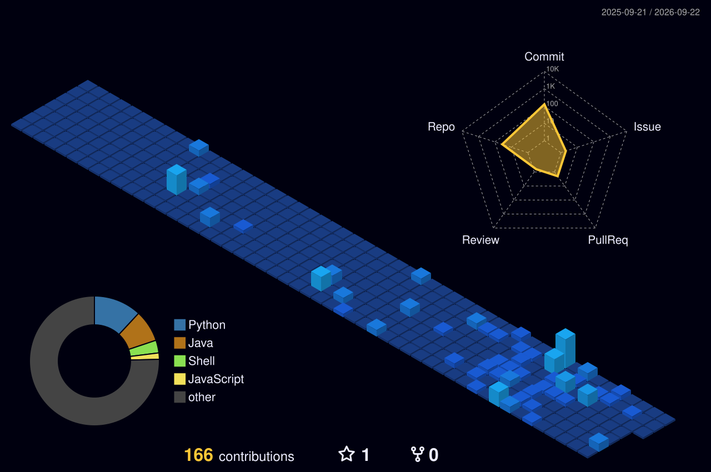

  

<h1 align="center">
   
  System Online: Sup? I'm <a href="https://github.com/Deathdestruction09" style="color: #39FF14; text-decoration: underline wavy;">Rakshit Raj</a>
</h1>

   
  

 

 

<table align="center" width="98%" style="border: none;">
<tr>
<td width="50%" valign="top" style="border: none;">

### 👨‍💻 `<SourceCode />`
> *Architecting software & systems.*

* **Core Intelligence:** MATHEMATICS,DSA,DATA SCIENCE
* **Main Languages:** C++,C,Java, Python
* **Web Stack:** Full Stack (React + Node + Hosting)
* **Basic Grind:** LeetCode & Codeforces Problem 

</td>

<td width="50%" valign="top" style="border: none;">
  
 

### 🏋️ `Physical_State.log`
* **Status:** 🟢 ** Cutting Phase**
* **Objective:** Live a good life
* **Daily Routine:** Classes > Calorie > Create > Repeat

</td>
</tr>
</table>

  <h3>🛠️ TECH Arsenal</h3>
  

  <h4> System Tools: </h4>
  
  

 

 

  <h3>🏙️ SYSTEM ARCHITECTURE: 3D COMMIT CITY</h3>
  
<i> My code contributions rendered as an isometric voxel world.</i>

  

 

  <h3>⚡ CONTRIBUTION ACTIVITY</h3>
  

  

 

  <h3>🎮 PLAY MY MINI GAME</h3>
  
  
<i>Click in if you dare.</i>

 

  <h2 style="font-family: 'Georgia', serif; font-style: italic; color: #ffffff; letter-spacing: 1px;">
    <h3><i>"The best way to predict the future is to create it on the chessboard"."</i></h3>
  </h2>
  
   
  
  
  
  
  

    
  

  

