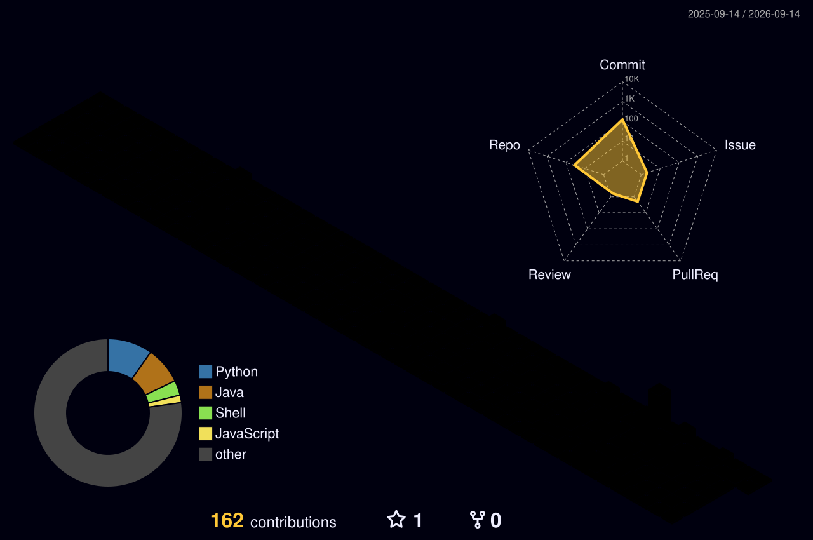

  

<h1 align="center">
  
  System Activated: Sup? I'm <a href="https://github.com/Deathdestruction09">Rakshit Raj</a>
</h1>

  <i>B.Tech CSE student | AI/ML track | DSA, Java, C++, Python | building cool things one commit at a time</i>

  

 

| `PROFILE SIGNAL` | `CURRENT STATE` |
|---|---|
| **Core Areas**: Mathematics, DSA, Data Science | **Status**: Learning, building, improving |
| **Languages**: C, C++, Java, Python | **Current Mission**: Strong projects + stronger fundamentals |
| **Web Stack**: React, Node.js, MongoDB, GitHub Pages | **Routine**: Classes > Code > Gym > Repeat |
| **Focus**: Practical problem solving and real skill growth | **Mindset**: Calm grind, sharp intent |

 

  <h3>🛠️ STACK</h3>
  

  <h4>System Tools</h4>
  
  
  

 

  <h3>⚙ CURRENT SIGNAL</h3>
  
<i>Currently focused on DSA, Java/C++ problem solving, AI/ML foundations, and building projects that look clean and work properly.</i>

 

  <h3>🚀 FEATURED BUILDS</h3>
  
<i>Picked from my public repositories.</i>

  
  

  
  

 

  <h3>📈 CONTRIBUTION ACTIVITY</h3>
  

 

  <h3>🏙️ 3D COMMIT CITY</h3>
  
<i>My contribution history rendered like a digital skyline.</i>

  

 

 

  <h3>🎧 HANDPICKED PLAYLISTS</h3>
  
<i>Fuel for coding sessions, night drives, gym reps, and overthinking at 2 a.m.</i>

|  Spotify |  YouTube |
|---|---|
| [Late Night Rotation](https://open.spotify.com/playlist/7dpwDH3wknuZEkkcDer4rV) | [Playlist One](https://www.youtube.com/playlist?list=PLRXQynGd6yOydVO5gP6_4NdgEXM0FV-rv) |
| [Mood Switch Mix](https://open.spotify.com/playlist/5K18wwxkdPIBqBleHmIBOA) | [Playlist Two](https://www.youtube.com/playlist?list=PLRXQynGd6yOz2ZGiQIj61EsVwCm1SvbdD) |

 

  
<b>🧠 More about me</b>

   
  <ul>
    <li>Interested in AI/ML, software building, and practical coding.</li>
    <li>Likes games, cinema, fitness, and learning through projects.</li>
    <li>Prefers making things that are simple, useful, and actually run.</li>
    <li>If not career focused you'll find me close to the nature.</li>
  </ul>

 

  <h3>📡 CONNECT</h3>
  
  
  
  
  

    

  

 

  <h3><i>"The best way to predict the future is to create it on the chessboard".</i></h3>

  

